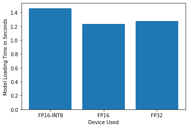
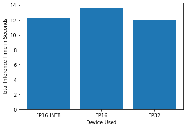
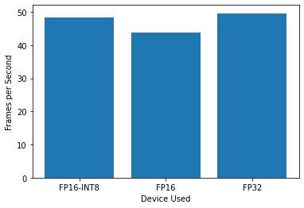

# Computer Pointer Controller

This is the code for the final assessment project for Udacity's Intel Edge AI for IoT Developers Nanodegree course.

This project uses the Gaze Estimation model to estimate the gaze of the user's eyes and change the mouse pointer position accordingly.

## Project Set Up and Installation

### Prerequisites

 - [Python](https://www.python.org/) - It's a programming language that lets you work quickly and integrate systems more effectively.
 - [OpenVINO](https://software.intel.com/content/www/us/en/develop/tools/openvino-toolkit.html) - It's a free toolkit facilitating the optimization of a Deep Learning model from a framework and deployment using an inference engine onto Intel hardware.

### Install dependencies

```
pip install -r requirements.txt
```

### Download models

Use the [OpenVINO Model Downloader](https://docs.openvinotoolkit.org/latest/_tools_downloader_README.html) to obtain the specific pre-trained models for this project.

```
./downloader.py --output_dir /path/to/models --name face-detection-adas-binary-0001
./downloader.py --output_dir /path/to/models --name head-pose-estimation-adas-0001
./downloader.py --output_dir /path/to/models --name landmarks-regression-retail-0009
./downloader.py --output_dir /path/to/models --name gaze-estimation-adas-0002
```

## Demo

To run a basic demo of this application you can use the following command:

```
python3 ./src/main.py -t video -p ./bin/demo.mp4 -mf ./path/to/model/face-detection-adas-binary-0001.xml -mfl ./path/to/model/landmarks-regression-retail-0009.xml -mg ./path/to/model/gaze-estimation-adas-0002.xml -mhp ./path/to/model/head-pose-estimation-adas-0001.xml -io
```

## Documentation

### Project structure

- ```\bin``` Directory containing the demo input video
- ```\img``` Directory containing the useful images for project documentation
- ```\src``` Directory containing all the project source files
    - ```main.py``` The entry point of the application, containing the entire flow
    - ```input_feeder.py``` The class used to feed input from an image, webcam, or video
    - ```mouse_controller.py``` The class used to control the mouse pointer
    - ```face_detection.py``` The Face Detector model class
    - ```facial_landmarks-detections.py``` The Facial Landmarks Detector model class
    - ```head_pose_estimation.py``` The Head Pose Estimator model class
    - ```gaze_estimation.py``` The Gaze Estimator model class
- ```\requirements.txt``` The requirements file containing all the necessary dependencies

### Command line arguments

- ```-t, --input_type``` Input type: cam (default), image, video
- ```-p, --input_path``` Absolute path to image or video file")
- ```-d, --device``` Specify the target device to infer on: CPU (default), GPU, FPGA, MYRIAD")
- ```-e, --cpu_extension``` Absolute path to a shared library with the kernels impl.")
- ```-mf, --model_face_detector``` Absolute path to the Face Detector model xml file")
- ```-mfl, --model_facial_landmarks_detector``` Absolute path to the Facial Landmarks Detector model xml file")
- ```-mg, --model_gaze_estimator``` Absolute path to the Gaze Estimator model xml file")
- ```-mhp, --model_head_pose_estimator``` Absolute path to the Head Pose Estimator model xml file")
- ```-pf, --prob_face_detector``` Probability threshold for Face Detector model detections (0.5 by default)")
- ```-pfl, --prob_facial_landmarks_detector``` Probability threshold for Facial Landmarks Detector model detections (0.5 by default)")
- ```-pg, --prob_gaze_estimator``` Probability threshold for Gaze Estimator model estimations (0.5 by default)")
- ```-php, --prob_head_pose_estimator``` Probability threshold for Head Pose Estimator model estimations (0.5 by default)")
- ```-io, --intermediate_output``` Show the outputs of intermediate models")
- ```-mp, --mouse_precision``` Mouse controller precision: low, medium (default), high")
- ```-ms, --mouse_speed``` Mouse controller speed: slow, medium (default), fast")

### Other documentation

- [OpenVINO](https://docs.openvinotoolkit.org/latest/index.html)
- [OpenCV](https://docs.opencv.org/)
- [PyAutoGUI](https://pyautogui.readthedocs.io/en/latest/)
- [Face Detector model](https://docs.openvinotoolkit.org/latest/_models_intel_face_detection_adas_binary_0001_description_face_detection_adas_binary_0001.html)
- [Facial Landmarks Detector model](https://docs.openvinotoolkit.org/latest/_models_intel_landmarks_regression_retail_0009_description_landmarks_regression_retail_0009.html)
- [Head Pose Estimator model](https://docs.openvinotoolkit.org/latest/_models_intel_head_pose_estimation_adas_0001_description_head_pose_estimation_adas_0001.html)
- [Gaze Estimator model](https://docs.openvinotoolkit.org/latest/_models_intel_gaze_estimation_adas_0002_description_gaze_estimation_adas_0002.html)

## Benchmarks

The following results are obtained running the whole inference process in the Intel DevCloud environment, on Intel i5-6500TE CPU device, with FP16, FP32 and FP16-INT8 precisions. 





### Results

FP16-INT8 is the most lightweight model between the available ones, it has a low inference time (like the FP32) but the benchmarks show that it takes much time to load than the other precisions. Because it uses 8 bit parameters it has low accuracy and could not be a perfect choice for this application.

FP16 precision model has a better loading time (though there no a great difference between all the precisions), while the FP32 has a better inference time.

Probably it may need additional time to unpack 32, 16 and 8 bits into the 64 bit aligned memory of the Intel processor, so despite the weight of the FP32 precision model it seems to be the better choice in terms of performance.